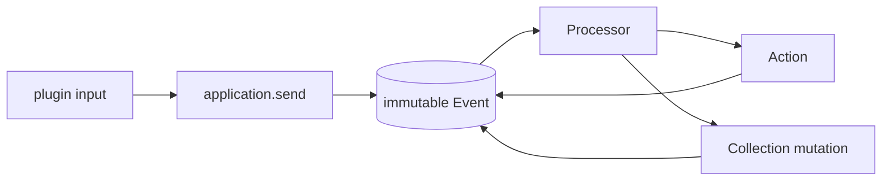

# Copilotz

Copilotz 0.62 is a plugin-first, event-sourced runtime for durable AI
applications. The runtime owns generic mechanics; plugins own business meaning.



Plugins contribute five primitives:

- Collections: durable semantic state and relations.
- Actions: executable capabilities with one durable lifecycle.
- Processors: event-driven orchestration.
- Resources: process-local agents, models, tools, skills, configuration, and
  policy.
- Adapters: application-owned custom external implementations.

Messages, agents, models, tools, and channels belong to their semantic plugins.
Goals are a small Core authoring loop over ordinary application sends. The
generic runtime contains no provider catalog, Tool executor, conversation DTO,
or hidden workflow controller.

## Install

```ts
import { createCopilotz } from "jsr:@copilotz/copilotz@^0.66.4";
```

Host-only capabilities live on explicit subpaths. Importing the root does not
pull in filesystem, subprocess, terminal, MCP stdio, or provider credentials.

## Compose an AI application

```ts
import { createCopilotz } from "jsr:@copilotz/copilotz@^0.66.4";
import { corePlugin, message } from "jsr:@copilotz/copilotz@^0.66.4/core";

const openAiKey = Deno.env.get("OPENAI_API_KEY");
if (!openAiKey) throw new Error("OPENAI_API_KEY is required");

const app = await createCopilotz({
  namespace: "acme",
  database: { url: ":memory:" },
  plugins: [corePlugin],
  resources: {
    agents: {
      support: {
        id: "support",
        name: "Support",
        role: "Answer clearly and use only explicitly granted capabilities.",
        models: { generate: ["default"] },
        capabilities: {},
      },
    },
    models: {
      default: {
        provider: "openai",
        model: "provider-model-id",
        apiKey: openAiKey,
      },
    },
  },
});

// A Channel, onboarding flow, or trusted Gateway route has already
// created this thread and its human/agent participants.
const operation = await app.send(message({
  thread: "thread-1",
  participant: "user-1",
  recipientIds: ["agent-support"],
  content: "How can you help me?",
}));

for await (const output of operation.outputs) {
  console.log(output.type, output.correlationId);
}
await operation.done;
await app.close();
```

`send()` accepts one plugin-owned input envelope. It returns a durable operation
identity, its ingress Event and correlation identities, an opaque replay cursor,
a local output attachment, and settlement controls. `detach()` stops only that
observer; `cancel()` is an explicit durable cancellation. `attach()` can resume
the same operation from any Gateway replica, while `operationStatus()`,
`listOperations()`, and `cancelOperation()` provide the generic host policy
seams. `observe()` remains an independent process-local application-wide
subscription. Gateway adds `fetch`; Worker returns `{ ready, closed, close }`.

For multi-turn evaluation, `runGoal` from `@copilotz/copilotz/goals` alternates
settled target and lead sends without introducing another durable state machine.
See [Goal runner](./docs/goals.md).

## Core guarantees

- Collection state, Event Bodies, immutable Events, and required delivery
  obligations commit atomically.
- Durable Processor execution is at least once. Stable mutation operation keys
  and Action identities make retries restore the same result.
- Action lifecycle data is self-contained and authenticated by runtime-created
  Event Bodies. Public input cannot forge a registered lifecycle receipt.
- Model Resources describe atomic model deployments. Agents and direct LLM calls
  own an ordered list of model aliases for fallback. Built-in Model Resources
  carry inline process-local credentials or reference one reusable,
  provider-bound `llmCredentials` Resource. Credential resolvers run once per
  alias and LLM call; their secrets never enter the durable call contract.
  `createLlmAdapter` defines a genuinely custom provider implementation.
- Tool Resources are data-only presentations of the same Action aliases that
  Core invokes. There is no second Tool execution path.
- Progressive `stream.output` observations contain generic content metadata and
  one subscriber-owned byte follower. Semantic routing stays in plugins.
- Operation replay stores semantic ordering in existing durable Events and
  progressive bytes in their existing Bodies. Its catalog stores only bounded
  discovery, lifecycle, and byte-offset metadata; it is not a second payload
  journal.
- Normal provisioning creates only a fresh v4 schema or validates an existing v4
  schema. Legacy databases require the explicit migration.

## Public package map

| Area               | Subpaths                                                                                                                              |
| ------------------ | ------------------------------------------------------------------------------------------------------------------------------------- |
| Application        | root factory; `/application` types                                                                                                    |
| Generic primitives | `/actions`, `/collections`, `/content`, `/streams`, `/events`, `/plugins`, `/persistence`                                             |
| AI harness         | `/core`, `/llm`, `/llm/tokens`, `/tools`, `/skills`, `/knowledge`, `/memory`, `/goals`, `/usage`                                      |
| Integrations       | `/channels`, `/schedules`, `/schedules/core`, `/admin`, `/server`                                                                     |
| Host capabilities  | `/adapters/deno`, `/core/cli`, `/core/cli/node`, `/skills/deno`, `/tools/deno`, `/tools/mcp/stdio`, `/tools/persistent-terminal/deno` |
| Tool factories     | `/tools/builtin`, `/tools/finance`, `/tools/mcp`, `/tools/openapi`, `/tools/persistent-terminal`, `/tools/web`                        |
| Database upgrade   | `/migration/v4`                                                                                                                       |

The authoritative export list is `deno.json`. There are no `/domain`,
`/attachments`, generic `/adapters`, `/adapters/node`, or legacy migration
subpaths.

## Documentation

- [Quickstart](docs/quickstart.md)
- [Architecture](docs/architecture.md)
- [API and package reference](docs/api.md)
- [Plugins and processors](docs/plugins-and-processors.md)
- [Events, deliveries, and recovery](docs/events-deliveries-recovery.md)
- [Content and assets](docs/content-assets.md)
- [Server façade](docs/server.md)
- [Progressive streams](docs/streams.md)
- [Embedding, Gateway, and Worker roles](docs/embedding-and-hypervisors.md)
- [Legacy 0.47/0.48 to v4 migration](docs/migration-v4.md)

The first-principles contract is [ARCHITECTURE.md](ARCHITECTURE.md).

## Verification

```sh
deno task check
deno task test
deno publish --dry-run --allow-dirty
```

## License

MIT
