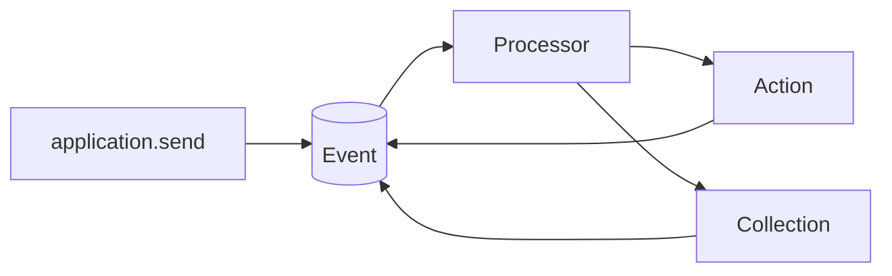

# Architecture

Copilotz separates durable meaning from execution placement. Applications send
plugin-owned input envelopes; the runtime persists and dispatches immutable
Events; plugin Processors react by invoking Actions or mutating Collections.

## Ownership

The generic runtime owns:

- Event Bodies, Events, sparse durable deliveries, and settlement scopes;
- Collection planning, graph projection, content adoption, and replay;
- Action lifecycle persistence and invocation identity;
- application composition, persistence recovery, and execution transport;
- generic progressive Bodies and stream observation.

Plugins own semantic contracts and workflows. Core owns participants, threads,
messages, Agent Resources, prompt policy, and the conversation loop. LLM owns
`llm.call`, LLM connections, Adapter contracts, and built-in provider drivers.
Tools, Channels, Memory, Knowledge, Skills, Schedules, Usage, and Admin own
their respective Collections, Actions, Processors, Resources, and Adapters.
Goals are a Core authoring loop over ordinary application sends.

Runtime production code never imports a concrete plugin.

## Five plugin primitives

- Collections describe durable state.
- Actions describe executable capabilities.
- Processors decide when capabilities or mutations run.
- Resources are immutable process-local semantic definitions. Their contracts
  may include typed, read-only policy hooks.
- Adapters are runtime-only interchangeable external or infrastructure
  implementations.

Resources and Adapters compose independently. Application overlays win after
plugin dependencies and root plugins. Plain typed values are canonical; helpers
such as `defineAgent`, `defineLlmConnection`, and `defineTool` add validation
and inference, not privileged object identities.

## Durable lifecycle

A Collection mutation commits its projection, Event Body, immutable Event, and
matched delivery obligations atomically. An Action emits
`<actionId>.invoked|progress|completed|failed|cancelled`; those Events are its
only operational record.

Action metadata is plugin-owned, canonical JSON. It is persisted in every
lifecycle Event Body and received as `context.action.metadata`. It is not copied
to the generic Event envelope or inherited by nested calls.
Runtime-authenticated Event Body references prevent public ingress from forging
registered Action lifecycle receipts.

Durable Processor execution is at least once. A Processor receives the resolved
Event first and the complete composed context second. Stable operation keys and
Action identities make a retry restore the same mutation/result. A Processor may
declare detached settlement for durable background work that must not block or
fail the foreground operation.

## AI harness

Agent, LLM connection, Tool, and Skill values are Resources. Declarative fields
are data; Agent instruction resolution, Context contribution, and Skill reading
are examples of typed process-local policy hooks. Hooks are neither durable
Actions nor persisted configuration. Built-in provider credentials and transport
configuration live only in process-local LLM connections; custom provider
implementations live in Adapters. Core turns an Agent's ordered connection/model
selections into one `llm.call` Action. Tool Resources map model presentation to
the same Action aliases present under `context.actions`; there is no Tool
catalog, executor, wrapper Action, or second validation lifecycle. Tool and
OpenAPI factories are compiler conveniences that materialize native Actions plus
those data-only Tool Resources.

Multiple model-produced Tool calls form a deterministic plan. Independent root
branches run concurrently, stages inside each pipeline run sequentially, and the
fan-in projects results in provider order. Ask uses a native Core Action and
durable question/answer messages; nested continuation state is stored in compact
non-recursive metadata rather than an in-memory promise.

## Content and streams

Potentially large or binary values become immutable Assets referenced by
`ContentRef`. Collection-declared content is prepared before SQL and adopted in
the same transaction as its owning semantic record.

A progressive Stream is a runtime Body, not a conversation primitive. Opening
one emits a serializable `stream.output` descriptor with only namespace, content
metadata, causation/correlation, and stream ID. Each application subscriber
receives its own lazy byte follower. Thread, participant, routing, visibility,
Collection, and plugin policy never enter this generic descriptor.

Closing a stream seals its Body and returns `PreparedContent`; a semantic
Collection or Action must adopt canonical content. A short-lived operation
catalog records only descriptor, committed offset, seal state, digest, and
retention. It never duplicates stream bytes. Exact stream/final content may
adopt the sealed Body directly; mismatches retain a bounded observation Body.

## Application and execution

The public embedded application owns generic durable operations: `send`,
`attach`, status/list/cancel, bounded maintenance, live `observe`, and `close`.
Gateway adds portable `fetch`; Worker returns `{ ready, closed, close }`. The
root factory supports embedded, split in-process, WebSocket, and
injected-dispatcher topologies without changing plugin contracts.

`send()` subscribes before append and waits for its explicit settlement scope,
relayed output drain, and a final settlement check. Disconnecting or detaching
an observer never cancels that scope. `attach()` replays indexed Events and
follows committed Body ranges from an opaque cursor, then tails database
notifications with a bounded safety wakeup. `observe()` remains an independent
live application-wide subscription. A transient persistence outage interrupts
local handles but does not pretend to cancel durable deliveries; recovery and a
new attachment resume them after reconnection.

## Storage and replay

Events and Event Bodies are immutable replay/deduplication facts. Ordinary
maintenance compacts only settled deliveries. Graph nodes and edges are
projections rebuilt namespace-wide from the complete registered Collection set,
historical Asset manifests, and generic relation events.

Asset provenance is exactly the opaque identity `{ type, id }`. A Ready Asset
node's body ID is durable liveness authority. Database, filesystem, and object
BodyStores preserve location and bytes through replay without runtime semantic
special cases.

See [ARCHITECTURE.md](../ARCHITECTURE.md) for the full first-principles
contract.
